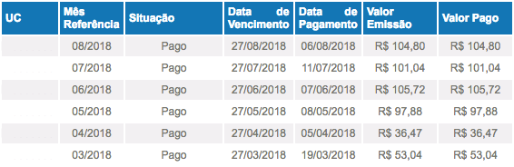

# CEEE Invoices

Navigate through the ["CEEE - Agência Virtual"](https://servicos.ceee.com.br/AgenciaWeb/autenticar/loginCliente.do) and download an image of the last invoices.


### Setup

install the dependencies

```sh
yarn
    # or npm install
```

create a `.env` file and fill with the values

```
CPF=""
PASSWORD=""
TELEGRAM_KEY="BOT_ACESS_KEY"
TELEGRAM_USER="USER/CHAT_TO_SEND_MESSAGE"
```

### Running

```sh
node index.js
   # or npm start
```

### Result

The result is the an image like below:

