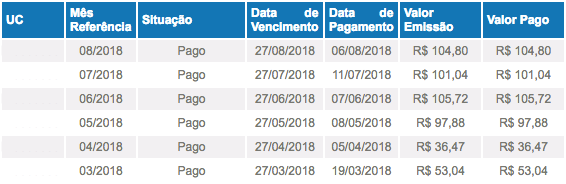

# CEEE Invoices

Navigate through the ["CEEE - Agência Virtual"](https://servicos.ceee.com.br/AgenciaWeb/autenticar/loginCliente.do) and download an image of the last invoices.


### Setup

```sh
yarn
    # or npm install
```

### Running

```sh
CPF="your_cpf" PASSWORD="your_passd" node index.js
```

### Result

The result is the an image like below:

